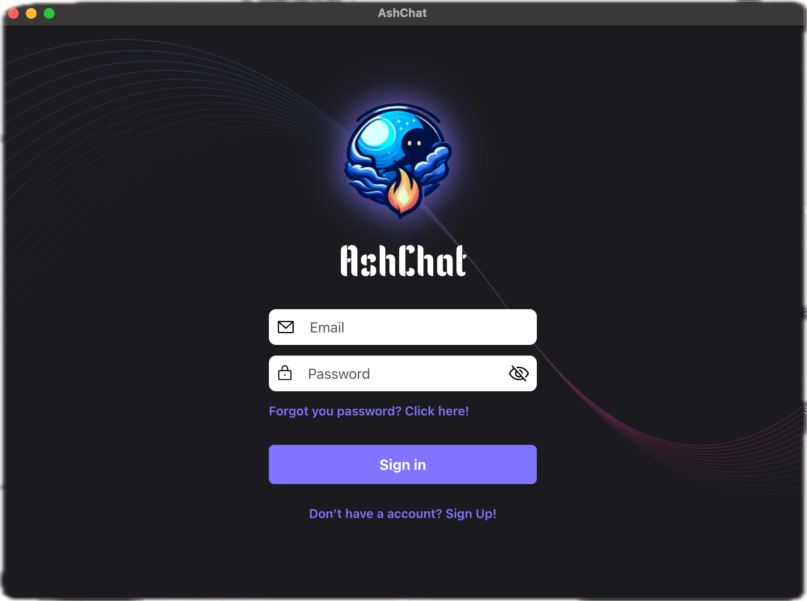
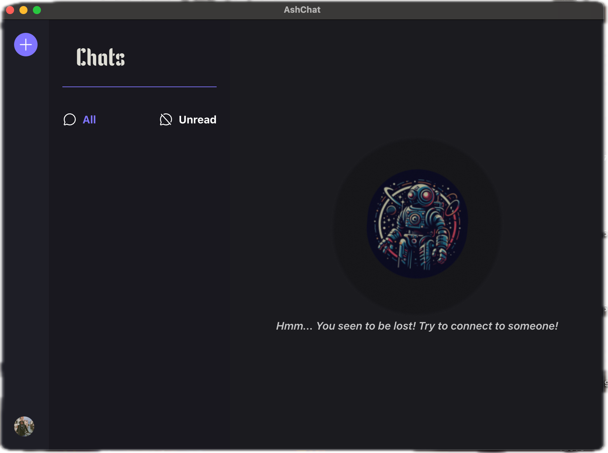
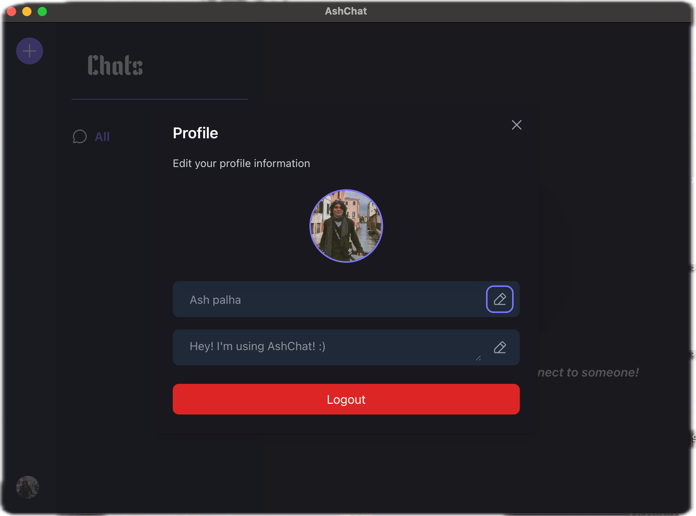
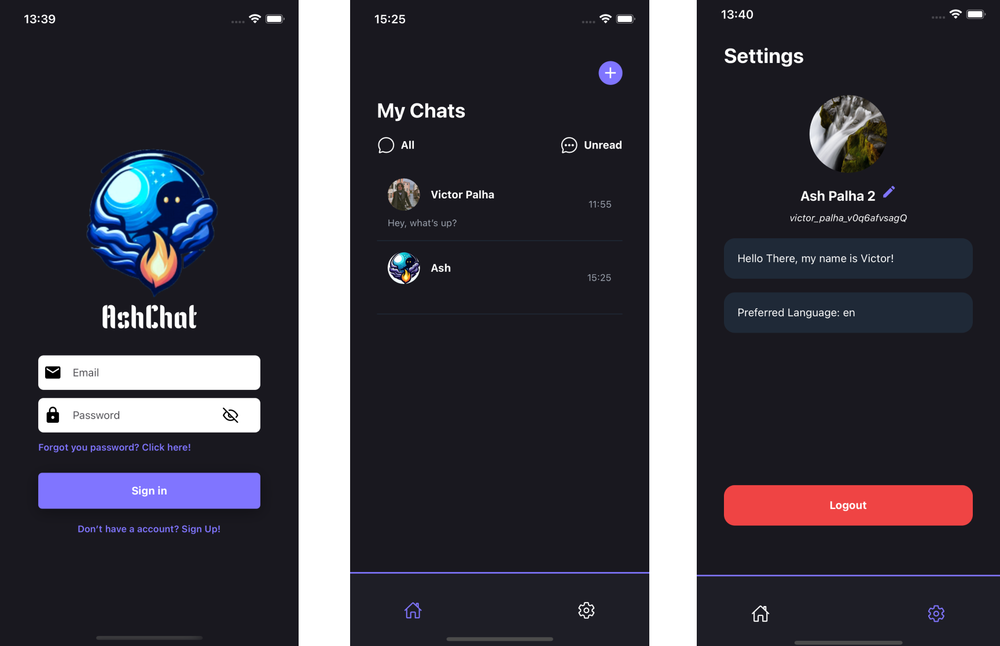
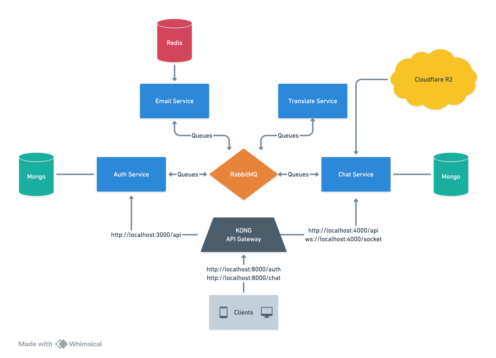

# AshChat

**AshChat** is a sophisticated web application designed to facilitate real-time communication between users. Leveraging the power of websockets, AshChat ensures seamless and instantaneous interaction between the server and clients. The application is developed using __Node.js__, __JAVA__, __Elixir__ and __React Native__.
This project is developed using microservices architecture and is divided into five services:
- **Authentication Service**
- **Chat Service**
- **Translation Service**
- **Email Service**

---

## Design
[Figma Design](https://www.figma.com/design/rPB1Q1Gnk8svporPUCEW1C/AshChat?node-id=0-1&t=wantuSG0vWp6POR4-1)






---

## Features

AshChat offers a robust chat room environment where users can engage in real-time conversations. Key features include:

- **User Accounts**: Each user has a personal and secure account.
- **Real-Time Chat**: Users can communicate with each other in real-time.
- **Online Status**: Users can see when their friends are online.
- **Typing Indicators**: Users can see when their friends are typing.
- **Offline Status**: Users can see when their friends are offline.
- **Multilingual Support**: Users can select their preferred language for communication.
- **Translation**: Messages are automatically translated to the recipient's chosen language.
- **Notifications**: Users receive notifications for new messages.
- **Profile Customization**: Users can customize their profiles with avatars and status messages.

---

### Main Feature

A standout feature of AshChat is its multilingual support. Users can select their preferred language for communication. The application translates messages to the recipient's chosen language, ensuring that both parties can converse in their preferred languages. This feature enhances the user experience by breaking down language barriers and promoting inclusive communication.

---

## AshChat Installation Guide

Follow these steps to install and run AshChat on your local machine.

---

### Prerequisites

Ensure the following are installed (_if running locally_):
- [Java](https://www.java.com/en/download/) (v23+)
- [Node.js](https://nodejs.org/) (v18+)
- [npm](https://www.npmjs.com/) (v10+)
- [Git](https://git-scm.com/)
- [Python](https://www.python.org/)
- [Elixir](https://elixir-lang.org/)
- [Docker](https://www.docker.com/)
- [Docker Compose](https://docs.docker.com/compose/)

---

### Recommendations
We strongly recommend running the application using Docker. For local setup instructions, refer to the [Local Installation Guide](./docs/run_locally.md).

---

### Docker Installation

To run the project using Docker:

1. **Set Up Environment Variables**:
   - Create a `.env` file in the root directory of each service.
   - Refer to `.env.example` for required variables (_email service_, _chat service_, and _translate service_).

2. **Generate JWT Key Files**:
   ```bash
   cd AshChat/infra/scripts
   chmod +x gen_keys.sh
   source gen_keys.sh
   ```

3. **Configure Docker Environment**:
   - Create a `.env` file in the `infra` directory.
   - Add the required variables from `.env.example`.

4. **Run the Project**:
   ```bash
   cd AshChat
   docker-compose up --build
   ```

---

## AshChat Architecture

### Overview

The AshChat application is designed with a microservices architecture, allowing different services to communicate and work together seamlessly. The primary components of the system include the **Auth Service**, **Email Service**, **Chat Service** and **Translate Service**. These services interact with each other through message queues using RabbitMQ and each service has its own method of storing data, such as MongoDB for the Auth Service and Redis for the Email Service.

---

### Components

#### 1. Auth Service

The Backend Service is responsible for handling user authentication on the AshChat application. It is built using **JAVA** and **Spring boot**. This service manages user registration, authentication, and 2FA (Two-Factor Authentication) using JWT (JSON Web Tokens) for secure communication between the services.

#### 2. Email Service

The Email Verification Service handles the process of verifying user email addresses during registration. It sends verification emails and processes email confirmation requests. This service is built using Node.js and integrates with RabbitMQ for message queuing and Redis for caching.
- **Nodemailer:** A module for Node.js applications to send emails.
- **RabbitMQ:** A message broker used for communication between services.
- **Redis:** A key-value store used for caching temporary data.

#### 3. Chat Service

The Chat Service is responsible for managing chat rooms and messages between users. It is built using Elixir and Phoenix Framework. The communication of messages between users is done in real-time using WebSockets and Channels in Phoenix.
- **Elixir:** A functional programming language built on the Erlang VM.
- **Phoenix Framework:** A web framework for Elixir that provides real-time functionality through WebSockets.
- **MongoDB:** A NoSQL database used to store chat messages and room information.
- **RabbitMQ:** A message broker used for communication between services.
- **Cloudflare R2:** A SAAS to deal with static files

#### 4. Translate Service

The Translate Service is responsible for translating messages between users in different languages. It is built using Python and uses the Google Translate API to perform translations. The service communicates with the Chat Service to receive messages and send translated messages back.
- **Python:** A high-level programming language used for building the translation service.
- **Google Translate API:** An API provided by Google for translating text between languages.
- **RabbitMQ:** A message broker used for communication between services.

---

## Communication Between Services

### KONG (Api Gateway)

Kong is a API Gateway that serves as a reverse Proxy to centralize all services at one endpoints, in that way facilitate the organization of systems and the communication between Client/Server



### MongoDB

MongoDB is a NoSQL database and are running at the main services for the **AshChat** system

### Message Queue (RabbitMQ)

RabbitMQ is used as the message broker to facilitate communication between the Backend Service and the Email Verification Service. When a user registers, the Backend Service sends a message to the `ACCOUNT_CREATION_QUEUE` in RabbitMQ. The Email Verification Service listens to this queue, processes the message, and sends a verification email to the user. Of course, this is just one example of how the services communicate with each other.

### Redis

Redis is used for caching temporary data, such as user information during the email verification process. The Email Verification Service stores user data in Redis with a time-to-live (TTL) value, ensuring that the data is available for a limited period.

## Sequence of Operations Example

1. **User Registration**
    - The user registers through the Auth Service.
    - The Auth Service sends a message to the `ACCOUNT_CREATION_QUEUE` in RabbitMQ with the user's email and other relevant information.

2. **Email Verification**
    - The Email Service listens to the `ACCOUNT_CREATION_QUEUE`.
    - Upon receiving a message, it stores the user data in Redis with a TTL of 10 minutes.
    - The service then sends a verification email to the user with a unique code.

3. **Email Confirmation**
    - The user receives the email and submits the verification code through the Auth Service.
    - The Auth Service validates the code by checking the data stored in Redis through the Email Service and sends a message to the `CONFIRM_EMAIL_CODE_QUEUE` in RabbitMQ.
    - If the code is valid, the user's email is confirmed, and the registration process is completed.

### Environment Configuration

Services require specific environment variables to function correctly. These variables are defined in their respective `.env.example` files. After cloning the repository, you should create a `.env` file for each service and populate it with the required variables.

---

## AshChat API Endpoints Documentation

This document provides detailed information about the API endpoints available in the AshChat application. It includes the request format, response format, possible errors, and status codes for each endpoint.

> IMPORTANT 
> Add JWT token in the Authorization header Bearer token and device_token to the http header

### Authentication Service Endpoints - http://localhost:3005/swagger-ui/index.html
All endpoints related to user authentication are available in the Authentication Service Swagger UI.
Just run the service and navigate to the Swagger UI to view the endpoints.

## Chat Service Endpoints - http://localhost:4000/api/swagger-ui/index.html
All endpoints related to user authentication are available in the Authentication Service Swagger UI.
Just run the service and navigate to the Swagger UI to view the endpoints.
