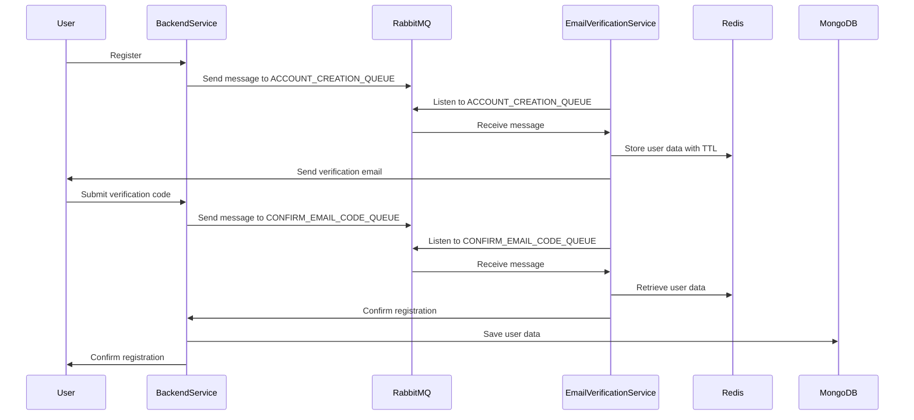
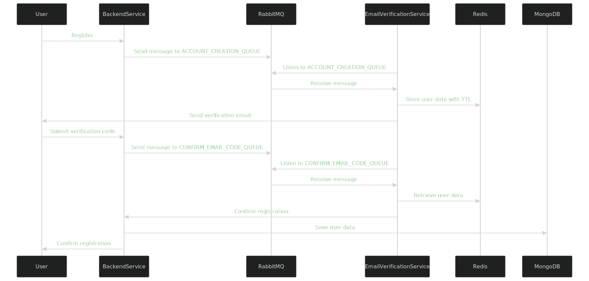

# AshChat Architecture

## Overview

The AshChat application is designed with a microservices architecture, allowing different services to communicate and work together seamlessly. The primary components of the system include the Backend Service and the Email Verification Service. These services interact with each other through message queues and shared databases.

## Components

### 1. Backend Service

The Backend Service is responsible for handling user authentication, chat functionalities, and other core features of the AshChat application. It is built using Node.js and Express.js, with Socket.io for real-time communication.
- **Express.js:** The backend service is built using Express.js, a web application framework for Node.js.
- **Socket.io:** Used for real-time communication between the server and clients.
- **Mongoose:** An ODM (Object Data Modeling) library for MongoDB and Node.js, used to interact with the MongoDB database.
- **Zod:** A TypeScript-first schema declaration and validation library.

### 2. Email Verification Service

The Email Verification Service handles the process of verifying user email addresses during registration. It sends verification emails and processes email confirmation requests. This service is built using Node.js and integrates with RabbitMQ for message queuing and Redis for caching.
- **Nodemailer:** A module for Node.js applications to send emails.
- **RabbitMQ:** A message broker used for communication between services.
- **Redis:** A key-value store used for caching temporary data.

## Communication Between Services

### Message Queue (RabbitMQ)

RabbitMQ is used as the message broker to facilitate communication between the Backend Service and the Email Verification Service. When a user registers, the Backend Service sends a message to the `ACCOUNT_CREATION_QUEUE` in RabbitMQ. The Email Verification Service listens to this queue, processes the message, and sends a verification email to the user.

### Redis

Redis is used for caching temporary data, such as user information during the email verification process. The Email Verification Service stores user data in Redis with a time-to-live (TTL) value, ensuring that the data is available for a limited period.

## Sequence of Operations Example

1. **User Registration**
    - The user registers through the Backend Service.
    - The Backend Service sends a message to the `ACCOUNT_CREATION_QUEUE` in RabbitMQ with the user's email and other relevant information.

2. **Email Verification**
    - The Email Verification Service listens to the `ACCOUNT_CREATION_QUEUE`.
    - Upon receiving a message, it stores the user data in Redis with a TTL of 10 minutes.
    - The service then sends a verification email to the user with a unique code.

3. **Email Confirmation**
    - The user receives the email and submits the verification code through the Backend Service.
    - The Backend Service validates the code by checking the data stored in Redis.
    - If the code is valid, the user's email is confirmed, and the registration process is completed.

## Environment Configuration

Both services require specific environment variables to function correctly. These variables are defined in their respective `.env` files. For example, the Email Verification Service requires `AMQP_URI`, `REDIS_URI`, `SMTP_EMAIL`, and `SMTP_PASSWORD`.

## Sequence Diagram

