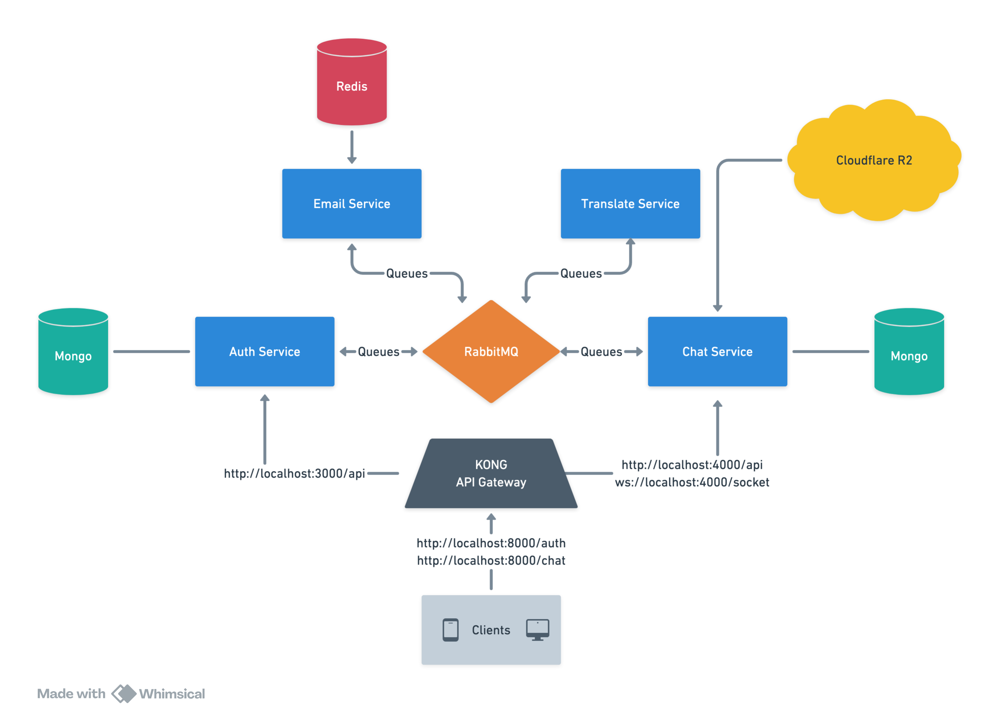

# AshChat Architecture

## Overview

The AshChat application is designed with a microservices architecture, allowing different services to communicate and work together seamlessly. The primary components of the system include the **Auth Service**, **Email Service**, **Chat Service** and **Translate Service**. These services interact with each other through message queues using RabbitMQ and each service has its own method of storing data, such as MongoDB for the Auth Service and Redis for the Email Service.

## Components

### 1. Auth Service

The Backend Service is responsible for handling user authentication on the AshChat application. It is built using Node.js and Express.js.
- **Express.js:** The backend service is built using Express.js, a web application framework for Node.js.
- **Mongoose:** An ODM (Object Data Modeling) library for MongoDB and Node.js, used to interact with the MongoDB database.
- **Zod:** A TypeScript-first schema declaration and validation library.

### 2. Email Service

The Email Verification Service handles the process of verifying user email addresses during registration. It sends verification emails and processes email confirmation requests. This service is built using Node.js and integrates with RabbitMQ for message queuing and Redis for caching.
- **Nodemailer:** A module for Node.js applications to send emails.
- **RabbitMQ:** A message broker used for communication between services.
- **Redis:** A key-value store used for caching temporary data.

### 3. Chat Service

The Chat Service is responsible for managing chat rooms and messages between users. It is built using Elixir and Phoenix Framework. The communication of messages between users is done in real-time using WebSockets and Channels in Phoenix.
- **Elixir:** A functional programming language built on the Erlang VM.
- **Phoenix Framework:** A web framework for Elixir that provides real-time functionality through WebSockets.
- **MongoDB:** A NoSQL database used to store chat messages and room information.
- **RabbitMQ:** A message broker used for communication between services.

### 4. Translate Service

The Translate Service is responsible for translating messages between users in different languages. It is built using Python and uses the Google Translate API to perform translations. The service communicates with the Chat Service to receive messages and send translated messages back.
- **Python:** A high-level programming language used for building the translation service.
- **Google Translate API:** An API provided by Google for translating text between languages.
- **RabbitMQ:** A message broker used for communication between services.

### 5. Static Files Service

The Static Files Service is responsible for serving static files, such as images and other assets, to the frontend application. It is built using Bun.
- **Bun:** A runtime for JS/TS applications

## Communication Between Services

### Message Queue (RabbitMQ)

RabbitMQ is used as the message broker to facilitate communication between the Backend Service and the Email Verification Service. When a user registers, the Backend Service sends a message to the `ACCOUNT_CREATION_QUEUE` in RabbitMQ. The Email Verification Service listens to this queue, processes the message, and sends a verification email to the user. Of course, this is just one example of how the services communicate with each other.

### Redis

Redis is used for caching temporary data, such as user information during the email verification process. The Email Verification Service stores user data in Redis with a time-to-live (TTL) value, ensuring that the data is available for a limited period.

## Sequence of Operations Example

1. **User Registration**
    - The user registers through the Auth Service.
    - The Auth Service sends a message to the `ACCOUNT_CREATION_QUEUE` in RabbitMQ with the user's email and other relevant information.

2. **Email Verification**
    - The Email Service listens to the `ACCOUNT_CREATION_QUEUE`.
    - Upon receiving a message, it stores the user data in Redis with a TTL of 10 minutes.
    - The service then sends a verification email to the user with a unique code.

3. **Email Confirmation**
    - The user receives the email and submits the verification code through the Auth Service.
    - The Auth Service validates the code by checking the data stored in Redis through the Email Service and sends a message to the `CONFIRM_EMAIL_CODE_QUEUE` in RabbitMQ.
    - If the code is valid, the user's email is confirmed, and the registration process is completed.

## Environment Configuration

Services require specific environment variables to function correctly. These variables are defined in their respective `.env.example` files. After cloning the repository, you should create a `.env` file for each service and populate it with the required variables.

## Authentication Flow Sequence Diagram

