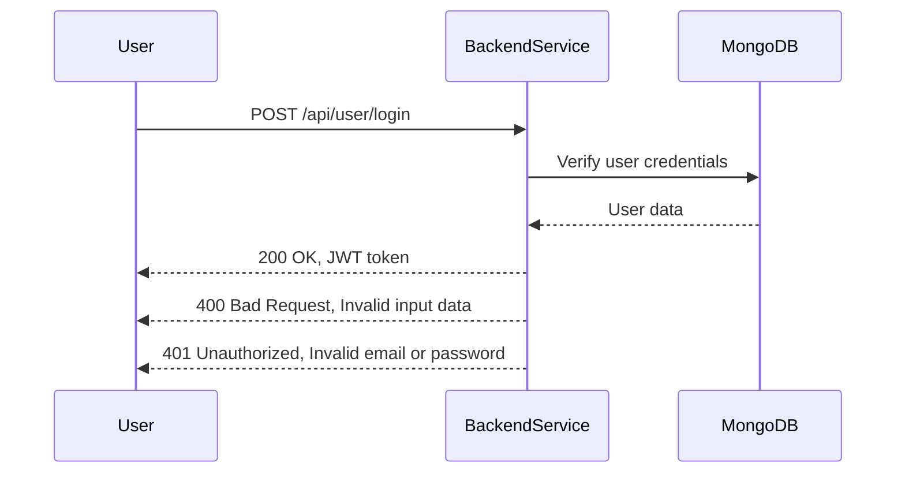
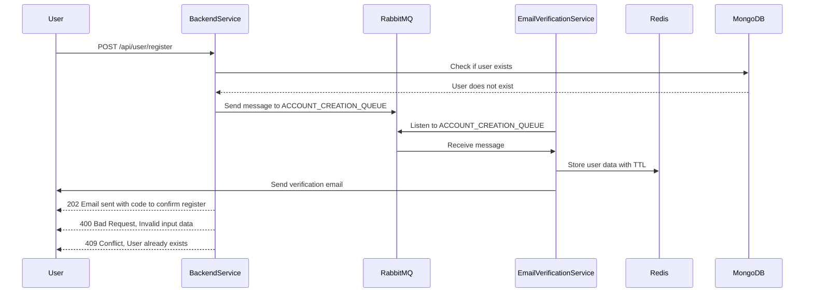
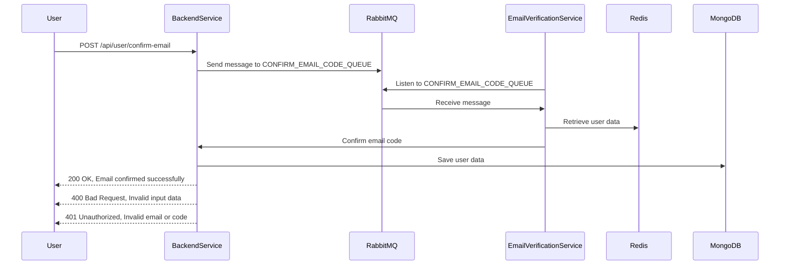
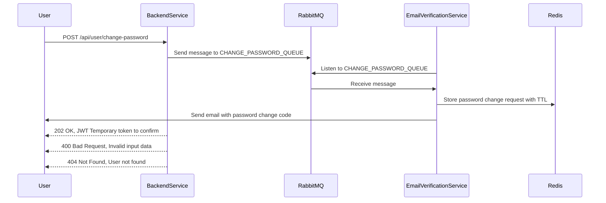
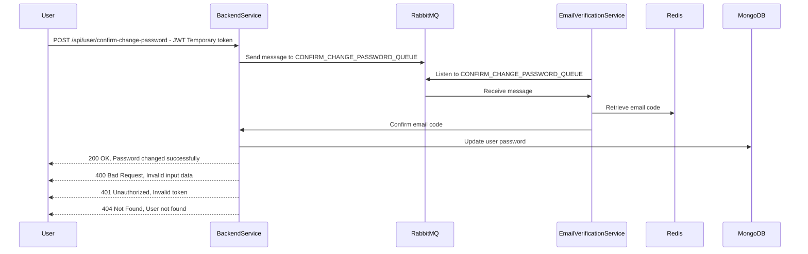

# AshChat API Endpoints Documentation

This document provides detailed information about the API endpoints available in the AshChat application. It includes the request format, response format, possible errors, and status codes for each endpoint.

## Table of Contents
1. [User Registration](#user-registration)
2. [User Login](#user-login)
3. [Confirm Email Code](#confirm-email-code)
4. [Change User Password](#change-user-password)
5. [Confirm Change User Password](#confirm-change-user-password)

## User Registration

### Endpoint
`POST /api/user/register`

### Request
```json
{
    "username": "john_doe",
    "email": "john@example.com",
    "password": "password123"
}
```

### Response
#### Success (201 Created)
```json
{
    "message": "User registered successfully",
    "userId": "unique_user_id"
}
```

#### Errors
- `400 Bad Request`: Invalid input data
- `409 Conflict`: User already exists

### Status Codes
- `201 Created`: User registered successfully
- `400 Bad Request`: Invalid input data
- `409 Conflict`: User already exists

## User Login

### Endpoint
`POST /api/user/login`

### Request
```json
{
    "email": "john@example.com",
    "password": "password123"
}
```

### Response
#### Success (200 OK)
```json
{
    "message": "Login successful",
    "token": "jwt_token"
}
```

#### Errors
- `400 Bad Request`: Invalid input data
- `401 Unauthorized`: Invalid email or password

### Status Codes
- `200 OK`: Login successful
- `400 Bad Request`: Invalid input data
- `401 Unauthorized`: Invalid email or password

## Confirm Email Code

### Endpoint
`POST /api/user/confirm-email`

### Request
```json
{
    "email": "john@example.com",
    "code": "123456"
}
```

### Response
#### Success (200 OK)
```json
{
    "message": "Email confirmed successfully"
}
```

#### Errors
- `400 Bad Request`: Invalid input data
- `401 Unauthorized`: Invalid email or code

### Status Codes
- `200 OK`: Email confirmed successfully
- `400 Bad Request`: Invalid input data
- `401 Unauthorized`: Invalid email or code

## Change User Password

### Endpoint
`POST /api/user/change-password`

### Request
```json
{
    "email": "john@example.com"
}
```

### Response
#### Success (200 OK)
```json
{
    "message": "Password change request successful"
}
```

#### Errors
- `400 Bad Request`: Invalid input data
- `404 Not Found`: User not found

### Status Codes
- `200 OK`: Password change request successful
- `400 Bad Request`: Invalid input data
- `404 Not Found`: User not found

## Confirm Change User Password

### Endpoint
`POST /api/user/confirm-change-password`

### Request
```json
{
    "email": "john@example.com",
    "newPassword": "newpassword123",
    "token": "temporaryToken"
}
```

### Response
#### Success (200 OK)
```json
{
    "message": "Password changed successfully"
}
```

#### Errors
- `400 Bad Request`: Invalid input data
- `401 Unauthorized`: Invalid token
- `404 Not Found`: User not found

### Status Codes
- `200 OK`: Password changed successfully
- `400 Bad Request`: Invalid input data
- `401 Unauthorized`: Invalid token
- `404 Not Found`: User not found

## User Login Workflow


[WorkFlow](https://mermaid.live/edit#pako:eNqNkUFrwzAMhf-K8Dkl2ejJhx5CL1sZHUu7XXIRsZqYJnYm2x1d6X-fQjvGoIz5ZIvvvSfJJ9V4Q0qrQO-JXENLiy3jUDuQsw3Es8WixGZPzlTEB9uQhud1tYEcR5snAfLet9ZdBL9JkT551_plqeGV2O6OMAmgYTLkosU-XGRXanYja2oBDEa8GSCCCdBwXxSwXmXw-LaB6AX5G58LXqKBl2nqEDN4cAfsrQHrxhT_kTcv7mDrMMXOs_0k8-NAA9oePMOIIXx4NipTA7FUjaz5NNnWKnY0UK20XA3yvla1Owsnfr46ukbpyIkyxT61ndI7WZS80ih9fX_QtXr-AknhlwA)

## User Registration Workflow


[WorkFlow](https://mermaid.live/edit#pako:eNqFU8FO4zAQ_ZWRz0Wt0F42ByQIPSABBZpyioQGe5qOmtjBdrqLEP_OuGnQVqXbnJyZeW_ePI8_lHaGVKYCvXVkNV0zVh6b0oJ8LfrImlu0ERaB_GH0CvWarJmT37Cmw_wTvr5yvHs8zEwb5PqZPC9ZY2Rnj3OQ4VDaPpFknF1c7PfN4GE2L2CMLY87KRh7qjjEQfB-saDvnK3c9VUG-Yr0GngJCQX0V0Chx-xKzn7olSSAcRTAutiDjvQZps9gLnFoKASsCKKDyzyfLe6Ll_xpelnczO5fHhfTxbSnOebMHuFtms-eohrqBXqMNRN_NfGGBnmnRaT7kJGi89QbZzAi_OG4gqK4PYlP_u0c2fxTAJQgPzr5DTqfnPfMEEg2Y9syLXDyQTu7ZN_Af-_-m-nXZCI5I8PL3oc4ghu7wZoNsG27uJ3oFMFvyKVlzVrQ253A2hOa990eqZFqyItYI8_rI5GVKq6ooVJlcjTo16Uq7afUYRfd_N1qlUXf0Uh511UrlS2xDvLXtaJmeJi76OcXyw1Hqg)

## Confirm Email Code Workflow


[WorkFlow](https://mermaid.live/edit#pako:eNqNU01vIjEM_StWzlTQVU9zqFRgVkKFsi1LTyMhNzFgMZPM5gOprfrf19MBVXTEsjkltt_L83PyrrQzpDIV6E8iq2nMuPFYFRZk1egja67RRlgG8t3oEPWOrFmQ37Ombv4JX144zh67mbxCLp_J85o1Rnb2PAcZDt3wzNmNGw8L26YafVe3t6eCMvg1X_yGPtbcT1LQ186u2VdX1NzeAk8RQnHUnMFC4lBRCLghiA5G84efk6fZKp_dTaar0Xycrx6X-TJvic51dEI55RDJXiY7IgR8jjcTZzTxno4SL8tonGxg0TMJrrEEDEa8iPxu66j1ET59hOYNnTHzMCXxErsXfquW8maKGfwYDGB-32sFwWFmZCAkraXVdSrL138z3AjDEI20Ks86xB5M7B5LNsC2TvE_JNwMrmFpMcWt8_xG5ouhbdn5z65VT1XkJWLkD703lIWKW6qoUJlsDfpdoQr7IXXC5RavVqss-kQ95V3abFW2xjLIKdWi6fj7DtGPv-D4Pjg)


## Change User Password Workflow


[WorkFlow](https://mermaid.live/edit#pako:eNqFk8tOwzAQRX9l5HVQK8Qqi0o8yrNQIClsIqHBnrajNnawnSKE-HcmhCCVUppV5nVy58Z-V9oZUqkK9FKT1XTCOPNYFhbkqdBH1lyhjTAJ5DezR6gXZE1GfsWaNuv3-PzM8fpuszIskZcP5HnKGiM7u51BhkNh20IjY28wWP9uCrfjLIceVtyrpaGn52hntFdhCK_Om3Z0fUYgnbgUMslDSSHgjCA6OD4_vDkbPt0eZtnj-P7k6W4ynAxbyjbda7wRh0h2B6lrl8lt0FSW18Qr6sTt1tCYJQtF5wm6_aH1A3zzk0OEV45zyPPRTlrj9rc71HS1k7-xzRH60-Ifwn5_H8ZXCVw-5pBTWTmP_k3sWbQmaWen7Mv_GQf9vtSMOPK1RAIXdoVLNsC2qiMYjLgLcAA3LsKpq61Jvk4SWImnTawSVZKXHY1chvcGVKg4p5IKlcqrQb8oVGE_pA_r6LI3q1UafU2J8q6ezVU6xWWQqK5ESXeNvrMfn-i-K7g)

## Confirm Change User Password Workflow


[WorkFlow](https://mermaid.live/edit#pako:eNqNk8lu2zAQhl9lwLMNp0VOOgSIl7Rp6yWW1VwEGAw5kolIpMrFhRvk3TuMIrSO4ro6iTPzf7ORT0wYiSxhDn8E1AKnipeW17kG-hpuvRKq4dpD5tD2rWMuHlHLFO1eCez71_zhQfn5Xd8zq7mqvqNVhRLcK6NPM1Aql-vWEcsYXl0d501gtUw3MOKNGgUKGAmjC2XrodhxXeKw4c79NFbCEL7cb2CDdWMstwfwhigt-JhIKbrSE0jJDjU6x0skCUyWi5vb9Xw7-Xy9-DTbrq7T9H65nm7vslk2a2mnujviflPOo_5PYicjwil4QqMSqPbYFXu-ljjaKPNWIekwhkK8EmelbzcwaUfeQ_TmOje6NNNxAlkjuUeIC4NuQ-9qSBTXnsDHiwtYfh3Aqttnu18JLghBLRehqg7_RlwSYswltUz33fkB3Oo9r5QEpZvggSri5wAfINM8-J2x6hfKP4TTl-kv8SUsjIcbEzQpoxE0nYt4ZgNWo6XxSXqPTxGUM7_DGnOW0K_k9jFnuX6mOEpv0oMWLPE24IBZE8odSwpeOTqFl8G-vuRX6_Nv7GZYWg)